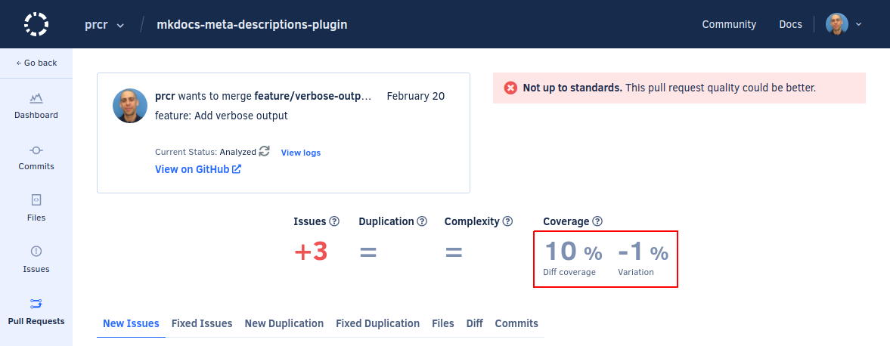

# Adding coverage to your repository

Code coverage is a metric used to describe the degree to which the source code of a program is tested. A program with high code coverage has been more thoroughly tested and has a lower chance of containing software bugs than a program with low code coverage. You can read more about the [basics of code coverage](https://blog.codacy.com/a-guide-to-code-coverage-part-1-code-coverage-explained/) on Codacy's blog.

Complete these main steps to start monitoring the test coverage of your repositories on Codacy:

1.  **Generating coverage reports**

    Ensure that you're generating one of the test coverage report formats supported by Codacy on each push to your repository.

1.  **Uploading coverage data to Codacy**

    After each push to your repository, run the Codacy Coverage Reporter to parse your report file and upload the coverage data to Codacy.

The next sections include detailed instructions on how to complete each step of the setup process.

## 1. Generating coverage reports {: id="generating-coverage"}

Before setting up Codacy to display code coverage metrics for your repository you must have tests and use tools to generate coverage reports for the languages in your repositories.

There are many tools that you can use to generate coverage reports for the languages used in your repositories. The following table contains example coverage tools that generate reports in formats that Codacy supports:

<table>
<thead>
<tr>
<th>Language</th>
<th>Example coverage tools</th>
<th>Report files</th>
</tr>
</thead>
<tbody>
<tr>
    <td rowspan="2">C#</td>
    <td><a href="https://github.com/OpenCover/opencover">OpenCover</a></td>
    <td><code>opencover.xml</code> (OpenCover)</td>
</tr>
<tr>
    <td><a href="https://www.jetbrains.com/help/dotcover/Running_Coverage_Analysis_from_the_Command_LIne.html">dotCover CLI</a></td>
    <td><code>dotcover.xml</code> (dotCover <a href="troubleshooting-common-issues/#detailedxml">detailedXML</a>)</td>
</tr>
<tr>
    <td>Go</td>
    <td><a href="https://blog.golang.org/cover">Golang</a> Code Coverage</td>
    <td>Golang report files don't have a specific name. Because of this, later in the setup process you must follow <a href="#submitting-coverage-for-golang">specific instructions</a> while submitting coverage to Codacy.</td>
</tr>
<tr>
    <td rowspan="2">Java</td>
    <td><a href="http://eclemma.org/jacoco/">JaCoCo</a></td>
    <td><code>jacoco*.xml</code> (JaCoCo)</td>
</tr>
<tr>
    <td><a href="http://cobertura.github.io/cobertura/">Cobertura</a></td>
    <td><code>cobertura.xml</code> (Cobertura)</td>
</tr>
<tr>
    <td>JavaScript</td>
    <td><a href="https://github.com/gotwarlost/istanbul">Istanbul</a><br/>
        <a href="https://github.com/deepsweet/poncho">Poncho</a><br/>
        <a href="https://mochajs.org/">Mocha</a> + <a href="https://github.com/alex-seville/blanket">Blanket.js</a></td>
    <td><code>lcov.info</code>, <code>lcov.dat</code>, <code>*.lcov</code> (LCOV)</td>
</tr>
<tr>
    <td>PHP</td>
    <td><a href="https://phpunit.readthedocs.io/en/stable/code-coverage-analysis.html">PHPUnit</a></td>
    <td><code>coverage-xml/index.xml</code> (PHPUnit XML version &lt;= 4)<br/>
        <code>clover.xml</code> (Clover)</td>
</tr>
<tr>
    <td>Python</td>
    <td><a href="https://coverage.readthedocs.io/en/coverage-5.0.3/">Coverage.py</a></td>
    <td><code>cobertura.xml</code> (Cobertura)</td>
</tr>
<tr>
    <td>Ruby</td>
    <td><a href="https://github.com/simplecov-ruby/simplecov">SimpleCov</a></td>
    <td><code>cobertura.xml</code> (Cobertura)<br/>
        <code>lcov.info</code>, <code>lcov.dat</code>, <code>*.lcov</code> (LCOV)</td>
</tr>
<tr>
    <td  rowspan="2">Scala</td>
    <td><a href="https://www.scala-sbt.org/sbt-jacoco/">sbt-jacoco</a></td>
    <td><code>jacoco*.xml</code> (JaCoCo)</td>
</tr>
<tr>
    <td><a href="http://scoverage.org/">scoverage</a></td>
    <td><code>cobertura.xml</code> (Cobertura)</td>
</tr>
<tr>
    <td>Swift/Objective-C</td>
    <td><a href="https://developer.apple.com/library/archive/documentation/DeveloperTools/Conceptual/testing_with_xcode/chapters/07-code_coverage.html">Xcode</a> Code Coverage</td>
    <td>See below how to generate coverage reports with Xcode</td>
</tr>
</tbody>
</table>

### Submitting coverage from unsupported report formats

If you're generating a report format that Codacy doesn't support yet, [contribute with a parser implementation](https://github.com/codacy/codacy-coverage-reporter/tree/master/coverage-parser/src/main/scala/com/codacy/parsers/implementation) yourself or use one of the community projects below to generate coverage reports in a supported format:

-   [SlatherOrg/slather](https://github.com/SlatherOrg/slather): generate Cobertura reports from Xcode coverage reports:

    ```bash
    gem install slather
    slather coverage -x --output-directory <report-output-dir> --scheme <project-name> <project-name>.xcodeproj
    ```

    This will generate a file `cobertura.xml` inside the folder `<report-output-dir>`.

-   [dariodf/lcov_ex](https://github.com/dariodf/lcov_ex): generate LCOV reports for Elixir projects
-   [chrisgit/sfdx-plugins_apex_coverage_report](https://github.com/chrisgit/sfdx-plugins_apex_coverage_report): generate LCOV or Cobertura reports from [Apex](https://help.salesforce.com/articleView?id=sf.code_apex_dev_guide_tools.htm&type=5) test coverage data
-   [danielpalme/ReportGenerator](https://github.com/danielpalme/ReportGenerator): convert between different report formats

As a last resort, you can also send the coverage data directly by calling one of the following Codacy API endpoints:

-   [saveCoverage](https://api.codacy.com/swagger#savecoverage)
-   [saveCoverageWithAccountToken](https://api.codacy.com/swagger#savecoveragewithaccounttoken)

## 2. Uploading coverage data to Codacy {: id="uploading-coverage"}

After having coverage reports set up for your repository, you must use Codacy Coverage Reporter to convert the reports to smaller JSON files and upload these files to Codacy. The recommended way to do this is using a CI/CD platform that automatically runs tests, generates coverage, and uses Codacy Coverage Reporter to upload the coverage report information for every push to your repository.

1.  Set up an API token to allow Codacy Coverage Reporter to authenticate on Codacy:
    {: id="authenticate"}

    -   **If you're setting up coverage for one repository**, [obtain a project API token](../codacy-api/api-tokens/#project-api-tokens) and set the following environment variable to specify your project API token:

        ```bash
        export CODACY_PROJECT_TOKEN=<your project API token>
        ```

    -   **If you're setting up and automating coverage for multiple repositories**, [obtain an account API Token](../codacy-api/api-tokens/#account-api-tokens) and set the following environment variables:
    
        -   **CODACY_API_TOKEN:** Your account API token.

        -   **CODACY_ORGANIZATION_PROVIDER:** Git provider hosting the repository.
        
            Must be one of `gh`, `ghe`, `gl`, `gle`, `bb`, or `bbe` to specify GitHub, GitHub Enterprise, GitLab, GitLab Enterprise, Bitbucket, or Bitbucket Enterprise, respectively.

        -   **CODACY_USERNAME:** Name of your organization on the Git provider, or your username on the Git provider if you're using a personal organization.
        
        -   **CODACY_PROJECT_NAME:** Name of the repository for which you're uploading the coverage information.

        ```bash
        export CODACY_API_TOKEN=<your account API token>
        export CODACY_ORGANIZATION_PROVIDER=<Git provider hosting the repository>
        export CODACY_USERNAME=<organization name or username on the Git provider>
        export CODACY_PROJECT_NAME=<repository name>
        ```

    !!! warning
        **Never write API tokens on your configuration files** and keep your API tokens well protected, as they grant owner permissions to your projects on Codacy

        We recommend that you set API tokens as environment variables. Check the documentation of your CI/CD platform on how to do this.

1.  **If you're using Codacy Self-hosted** set the following environment variable to specify your Codacy instance URL:

    ```bash
    export CODACY_API_BASE_URL=<your Codacy instance URL>
    ```

1.  Run Codacy Coverage Reporter **on the root of the locally checked out branch of your Git repository**, specifying the relative path to the coverage report to upload:

    ```bash
    bash <(curl -Ls https://coverage.codacy.com/get.sh) report -r <coverage report file name>
    ```

    !!! important
        Check the console output to validate that the Codacy Coverage Reporter **detected the correct commit UUID** and **successfully uploaded** the coverage data to Codacy. If you need help, [check the troubleshooting page](troubleshooting-common-issues.md) for solutions to the most common setup issues.

        Be sure to also check the sections below for more advanced functionality while uploading the coverage data to Codacy.

    !!! tip
        The self-contained script `get.sh` automatically downloads and runs the most recent version of Codacy Coverage Reporter.

        See [alternative ways of running Codacy Coverage Reporter](alternative-ways-of-running-coverage-reporter.md) for other ways of running Codacy Coverage Reporter, such as by installing the binary manually or using a GitHub Action or CircleCI Orb.

1.  Optionally, [add a Codacy badge](https://docs.codacy.com/repositories/badges/) to the README of your repository to display the current code coverage.

To validate that the coverage setup is complete, **wait until your repository has at least two new commits** and check that Codacy displays the coverage information on the last commit or in subsequent pull requests, either as a positive, negative, or no variation (represented by `=`) of the coverage percentage:



Follow [these troubleshooting steps](troubleshooting-common-issues.md#no-coverage-visible) if Codacy doesn't display the coverage data for your commit or pull request (represented by `-`).

### Uploading multiple coverage reports for the same language {: id="multiple-reports"}

If your test suite is split on different modules or runs in parallel, you must upload multiple coverage reports for the same language.

To do this, specify multiple reports by repeating the flag `-r`. For example:

```bash
bash <(curl -Ls https://coverage.codacy.com/get.sh) report \
    -l Java -r report1.xml -r report2.xml -r report3.xml
```

You can also upload all your reports dynamically using the command `find`. For example:

```bash
bash <(curl -Ls https://coverage.codacy.com/get.sh) report \
    -l Java $(find **/jacoco*.xml -printf '-r %p ')
```

!!! note
    Alternatively, you can upload each report separately with the flag `--partial` and notify Codacy with the `final` command after uploading all reports. For example:

    ```bash
    bash <(curl -Ls https://coverage.codacy.com/get.sh) report \
        --partial -l Java -r report1.xml
    bash <(curl -Ls https://coverage.codacy.com/get.sh) report \
        --partial -l Java -r report2.xml
    bash <(curl -Ls https://coverage.codacy.com/get.sh) final
    ```

    If you're sending reports for a language with the flag `--partial`, you should use the flag in all reports for that language to ensure the correct calculation of the coverage.

!!! tip
    It might also be possible to merge the reports before uploading them to Codacy, since most coverage tools support merge/aggregation. For example, <http://www.eclemma.org/jacoco/trunk/doc/merge-mojo.html>.

### Uploading the same coverage report for multiple languages {: id="multiple-languages"}

If your test suite generates a single coverage report for more than one language, you must upload the same coverage report for each language.

To do this, upload the same report multiple times, specifying each different language with the flag `-l`. For example:

```bash
bash <(curl -Ls https://coverage.codacy.com/get.sh) report \
    -l Javascript -r report.xml
bash <(curl -Ls https://coverage.codacy.com/get.sh) report \
    -l TypeScript -r report.xml
```

### Submitting coverage for Golang

Codacy can't automatically detect Golang coverage report files because they don't have specific file names.

If you're uploading a Golang coverage report, you must also specify the report type:

```bash
bash <(curl -Ls https://coverage.codacy.com/get.sh) report \
    --force-coverage-parser go -r <coverage report file name>
```

### Submitting coverage for unsupported languages

If your language is not in the list of supported languages, you can still send coverage to Codacy.

To do this, provide the correct language with the flag `-l`, together with `--force-language`. For example:

```bash
bash <(curl -Ls https://coverage.codacy.com/get.sh) report \
  -l Kotlin --force-language -r <coverage report file name>
```

See the [list of languages](https://github.com/codacy/codacy-plugins-api/blob/master/src/main/scala/com/codacy/plugins/api/languages/Language.scala#L43) that you can specify using the flag `-l`.
