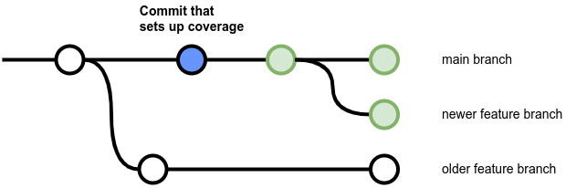
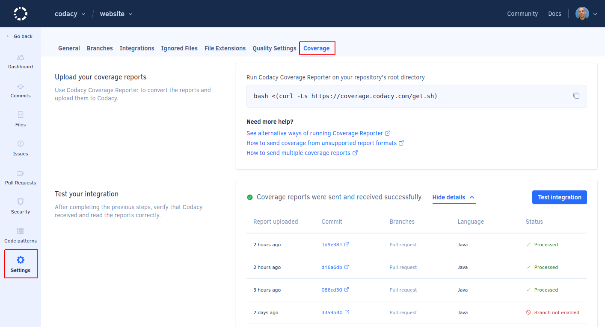
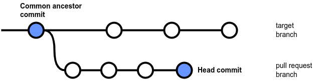

# Adding coverage to your repository

Code coverage is a metric used to describe the degree to which the source code of a program is tested. A program with high code coverage has been more thoroughly tested and has a lower chance of containing software bugs than a program with low code coverage. You can read more about the [basics of code coverage](https://blog.codacy.com/a-guide-to-code-coverage-part-1-code-coverage-explained/) on Codacy's blog.

To monitor the code coverage of your repository on Codacy you must generate coverage reports for each commit on your CI/CD workflow, and then upload the coverage data to Codacy.

Complete these main steps to set up coverage for your repository:

1.  **Generating coverage reports**

    Ensure that you're generating one of the code coverage report formats supported by Codacy on each push to your repository.

1.  **Uploading coverage data to Codacy**

    After each push to your repository, run the Codacy Coverage Reporter to parse your report file and upload the coverage data to Codacy.

1.  **Validating that the coverage setup is complete**

    Check if Codacy displays coverage information for new commits and pull requests and troubleshoot the coverage setup if necessary.

The next sections include detailed instructions on how to complete each step of the setup process.

## 1. Generating coverage reports {: id="generating-coverage"}

Before setting up Codacy to display code coverage metrics for your repository you must have tests and use tools to generate coverage reports for the source code files in your repository.

Consider the following when generating coverage reports for your repository:

-   There are many tools that you can use to generate coverage reports, but you must ensure that the coverage reports are in one of the formats that Codacy supports
-   If your repository includes multiple programming languages, you may need to generate a separate coverage report for each language depending on the specific languages and tools that you use
-   Make sure that you generate coverage reports that include coverage data for all source code files in your repository, and not just the files that were changed in each commit

The following table contains example coverage tools that generate reports in formats that Codacy supports:

<table>
<thead>
<tr>
    <th>Language</th>
    <th>Example coverage tools</th>
    <th>Report files</th>
</tr>
</thead>
<tbody>
<tr>
    <td rowspan="3">C#</td>
    <td><a href="https://github.com/OpenCover/opencover">OpenCover</a></td>
    <td><code>opencover.xml</code> (OpenCover)</td>
</tr>
<tr>
    <td><a href="https://www.jetbrains.com/help/dotcover/Running_Coverage_Analysis_from_the_Command_LIne.html">dotCover CLI</a></td>
    <td><code>dotcover.xml</code> (dotCover <a href="troubleshooting-common-issues/#detailedxml">detailedXML</a>)</td>
</tr>
<tr>
    <td><a href="https://github.com/coverlet-coverage/coverlet">Coverlet</a></td>
    <td>Make sure that you <a href="https://github.com/coverlet-coverage/coverlet/blob/master/Documentation/MSBuildIntegration.md#coverage-output">output the report files</a> in a supported format using one of the following file names:<br/>
        <code>opencover.xml</code> (OpenCover)<br/>
        <code>cobertura.xml</code> (Cobertura)<br/>
        <code>lcov.info</code>, <code>lcov.dat</code>, <code>*.lcov</code> (LCOV)
    </td>
</tr>
<tr>
    <td>Go</td>
    <td><a href="https://blog.golang.org/cover">Golang</a> Code Coverage</td>
    <td>Golang report files don't have a specific name. Because of this, later in the setup process you must follow <a href="uploading-coverage-in-advanced-scenarios/#golang">specific instructions</a> while submitting coverage to Codacy.</td>
</tr>
<tr>
    <td rowspan="2">Java</td>
    <td><a href="http://eclemma.org/jacoco/">JaCoCo</a></td>
    <td><code>jacoco*.xml</code> (JaCoCo)</td>
</tr>
<tr>
    <td><a href="http://cobertura.github.io/cobertura/">Cobertura</a></td>
    <td><code>cobertura.xml</code> (Cobertura)</td>
</tr>
<tr>
    <td>JavaScript</td>
    <td><a href="https://github.com/gotwarlost/istanbul">Istanbul</a><br/>
        <a href="https://mochajs.org/">Mocha</a> + <a href="https://github.com/alex-seville/blanket">Blanket.js</a></td>
    <td><code>lcov.info</code>, <code>lcov.dat</code>, <code>*.lcov</code> (LCOV)</td>
</tr>
<tr>
    <td>PHP</td>
    <td><a href="https://phpunit.readthedocs.io/en/9.5/code-coverage-analysis.html">PHPUnit</a></td>
    <td><code>coverage-xml/index.xml</code> (PHPUnit XML version &lt;= 4)<br/>
        <code>clover.xml</code> (Clover)</td>
</tr>
<tr>
    <td>Python</td>
    <td><a href="https://coverage.readthedocs.io/en/coverage-5.0.3/">Coverage.py</a></td>
    <td><code>cobertura.xml</code> (Cobertura)</td>
</tr>
<tr>
    <td>Ruby</td>
    <td><a href="https://github.com/simplecov-ruby/simplecov">SimpleCov</a></td>
    <td><code>cobertura.xml</code> (Cobertura)<br/>
        <code>lcov.info</code>, <code>lcov.dat</code>, <code>*.lcov</code> (LCOV)</td>
</tr>
<tr>
    <td  rowspan="2">Scala</td>
    <td><a href="https://www.scala-sbt.org/sbt-jacoco/">sbt-jacoco</a></td>
    <td><code>jacoco*.xml</code> (JaCoCo)</td>
</tr>
<tr>
    <td><a href="https://github.com/scoverage/scalac-scoverage-plugin">scoverage</a></td>
    <td><code>cobertura.xml</code> (Cobertura)</td>
</tr>
<tr>
    <td>Swift/Objective-C</td>
    <td><a href="https://developer.apple.com/library/archive/documentation/DeveloperTools/Conceptual/testing_with_xcode/chapters/07-code_coverage.html">Xcode</a> Code Coverage</td>
    <td>See below how to generate coverage reports with Xcode</td>
</tr>
</tbody>
</table>

### Handling unsupported languages

If you're generating a report format that Codacy doesn't support yet, [contribute with a parser implementation](https://github.com/codacy/codacy-coverage-reporter/tree/master/coverage-parser/src/main/scala/com/codacy/parsers/implementation) yourself or use one of the community projects below to generate coverage reports in a supported format:

-   [SlatherOrg/slather](https://github.com/SlatherOrg/slather): generate Cobertura reports from Xcode coverage reports:

    ```bash
    gem install slather
    slather coverage -x --output-directory <report-output-dir> --scheme <project-name> <project-name>.xcodeproj
    ```

    This will generate a file `cobertura.xml` inside the folder `<report-output-dir>`.

-   [dariodf/lcov_ex](https://github.com/dariodf/lcov_ex): generate LCOV reports for Elixir projects
-   [chrisgit/sfdx-plugins_apex_coverage_report](https://github.com/chrisgit/sfdx-plugins_apex_coverage_report): generate LCOV or Cobertura reports from [Apex](https://help.salesforce.com/articleView?id=sf.code_apex_dev_guide_tools.htm&type=5) code coverage data
-   [danielpalme/ReportGenerator](https://github.com/danielpalme/ReportGenerator): convert between different report formats

!!! important
    Make sure that you [specify the language](uploading-coverage-in-advanced-scenarios.md#unsupported-languages) when uploading coverage for an unsupported language.

As a last resort, you can also send the coverage data directly by calling one of the following Codacy API endpoints:

-   [saveCoverage](https://api.codacy.com/swagger#savecoverage)
-   [saveCoverageWithAccountToken](https://api.codacy.com/swagger#savecoveragewithaccounttoken)

## 2. Uploading coverage data to Codacy {: id="uploading-coverage"}

After having coverage reports set up for your repository, you must use the Codacy Coverage Reporter to upload them to Codacy.

The recommended way to do this is by using a CI/CD platform that automatically runs tests, generates coverage, and uses the Codacy Coverage Reporter to upload the coverage report information for every push to your repository.

!!! note "Alternative ways of running the Codacy Coverage Reporter"
    Codacy makes available [alternative ways to run the Codacy Coverage Reporter](alternative-ways-of-running-coverage-reporter.md), such as by installing the binary manually or by using Docker, a GitHub Action, or a CircleCI Orb.

    However, the instructions on this page assume that you'll run the recommended [self-contained bash script `get.sh`](alternative-ways-of-running-coverage-reporter.md#bash-script) to automatically download and run the most recent version of the Codacy Coverage Reporter.    

1.  Set up an API token to allow Codacy Coverage Reporter to authenticate on Codacy:
    {: id="authenticate"}

    -   **If you're setting up coverage for one repository**, [obtain a project API token](../codacy-api/api-tokens/#project-api-tokens) and set the following environment variable to specify your project API token:

        ```bash
        export CODACY_PROJECT_TOKEN=<your project API token>
        ```

    -   **If you're setting up and automating coverage for multiple repositories**, [obtain an account API Token](../codacy-api/api-tokens/#account-api-tokens) and set the following environment variables:

        -   **CODACY_API_TOKEN:** Your account API token.

        -   **CODACY_ORGANIZATION_PROVIDER:** Git provider hosting the repository.

            Must be one of `gh`, `ghe`, `gl`, `gle`, `bb`, or `bbe` to specify GitHub, GitHub Enterprise, GitLab, GitLab Enterprise, Bitbucket, or Bitbucket Enterprise, respectively.

        -   **CODACY_USERNAME:** Name of your organization on the Git provider, or your username on the Git provider if you're using a personal organization.

        -   **CODACY_PROJECT_NAME:** Name of the repository for which you're uploading the coverage information.

        ```bash
        export CODACY_API_TOKEN=<your account API token>
        export CODACY_ORGANIZATION_PROVIDER=<Git provider hosting the repository>
        export CODACY_USERNAME=<organization name or username on the Git provider>
        export CODACY_PROJECT_NAME=<repository name>
        ```

    !!! warning
        **Never write API tokens on your configuration files** and keep your API tokens well protected, as they grant owner permissions to your projects on Codacy

        We recommend that you set API tokens as environment variables. Check the documentation of your CI/CD platform on how to do this.

1.  **If you're using Codacy Self-hosted** set the following environment variable to specify your Codacy instance URL:

    ```bash
    export CODACY_API_BASE_URL=<your Codacy instance URL>
    ```

1.  Run Codacy Coverage Reporter **on the root of the locally checked out branch of your Git repository**, specifying the relative path to the coverage report to upload:

    ```bash
    bash <(curl -Ls https://coverage.codacy.com/get.sh) report -r <coverage report file name>
    ```

    Check the console output to validate that the Codacy Coverage Reporter **detected the correct commit SHA-1 hash** and **successfully uploaded** the coverage data to Codacy. If you need help, [check the troubleshooting page](troubleshooting-common-issues.md) for solutions to the most common setup issues.

    !!! note
        Be sure to also check the [instructions for more advanced scenarios](uploading-coverage-in-advanced-scenarios.md) while uploading the coverage data to Codacy, such as when running parallel tests, using monorepos, or testing source code in multiple or unsupported languages.

## 3. Validating that the coverage setup is complete {: id="validating-coverage"}

Codacy displays the code coverage in each branch, as well as the evolution of code coverage between commits and the code coverage variation introduced by pull requests.

Because of this, to ensure that all code coverage metrics are available on Codacy, you must have successfully uploaded coverage data and analyzed:

-   The last two commits in each branch
-   The common ancestor commit of each pull request branch and its target branch

!!! note "Example"
    The example below shows that after pushing a commit that correctly sets up coverage on the main branch:

    -   Codacy will report coverage metrics for all subsequent commits and pull requests relative to the main branch
    -   Codacy won't report coverage metrics for commits and pull requests that are relative to older branches where the coverage setup wasn't performed yet

    

Follow these instructions to validate that your coverage setup is working correctly:

1.  On Codacy, open your **Repository Settings**, tab **Coverage**, and observe the list of recent coverage reports in the section **Test your integration** to make sure that Codacy received the coverage data successfully for the **[correct commit SHA-1 hash](troubleshooting-common-issues.md#commit-detection) and branch**, and that it processed the coverage data successfully.

    

    If there are commits with a status different from **Processed**, please check the troubleshooting instructions for the corresponding error status:

    -   **Commit not found:** Codacy doesn't have information about the commit associated with the coverage data.

        <table>
        <thead>
        <tr>
            <th width="40%">What causes the error?</th>
            <th>How to fix the error?</th>
        </tr>
        </thead>
        <tbody>
        <tr>
            <td>
                Codacy didn't receive the webhook for that commit from the Git provider.
            </td>
            <td>
                <p>Wait a few more minutes until Codacy detects the commit and the status will update automatically.</p>
                <p>If it takes too long for Codacy to detect the commit, the webhook call from the Git provider may have been lost. You can wait until you push a new commit or contact us at <a href="mailto:support@codacy.com">support@codacy.com</a> to sync the commits on Codacy with your Git provider.<p>
            </td>
        </tr>
        <tr>
            <td>
                The commit SHA-1 hash sent while uploading coverage is wrong.
            </td>
            <td>
                Make sure that the Codacy Coverage Reporter <a href="#commit-detection">detects the correct commit SHA-1 hash</a> for the uploaded coverage data.
            </td>
        </tr>
        </table>

    -   **Branch not enabled:** the commit associated with the coverage data doesn't belong to any branch that Codacy is analyzing.

        <table>
        <thead>
        <tr>
            <th width="40%">What causes the error?</th>
            <th>How to fix the error?</th>
        </tr>
        </thead>
        <tbody>
        <tr>
            <td>
                Coverage was uploaded for a commit that belongs to a branch that isn't analyzed by Codacy.
            </td>
            <td>
                <p>Make sure that the <a href="../repositories-configure/managing-branches/">branch or target branch for pull requests is enabled on Codacy</a>.</p>
                <p>If Codacy is already analyzing the branch, make sure that the Codacy Coverage Reporter <href="#commit-detection">detects the correct commit SHA-1 hash</a> for the uploaded coverage data.</p>
            </td>
        </tr>
        <tr>
            <td>
                Coverage was uploaded for a commit that no longer belongs to any branch on the Git repository, for example after a rebase or squash merge.
            </td>
            <td>
                The error status is expected in this scenario and you can ignore it.
            </td>
        </tr>
        </table>

    -   **Commit not analyzed:** due to technical limitations, Codacy only reports coverage for a commit after successfully completing the static code analysis of that commit.

        <table>
        <thead>
        <tr>
            <th width="40%">What causes the error?</th>
            <th>How to fix the error?</th>
        </tr>
        </thead>
        <tbody>
        <tr>
            <td>
                Codacy hasn't finished analyzing the commit yet.
            </td>
            <td>
                Wait a few more minutes until Codacy completes the static code analysis for the commit and the status will update automatically.
            </td>
        </tr>
        <tr>
            <td>
                Codacy didn't analyze the commit on a private repository because the commit author isn't a member of the Codacy organization.
            </td>
            <td>
                Make sure that you <a href="../organizations/managing-people/#adding-people">add all commit authors as members of the Codacy organization</a>.
            </td>
        </tr>
        <tr>
            <td>
                Codacy skipped analyzing the commit because there are more recent commits in the branch.
            </td>
            <td>
                Upload coverage data for the most recent commit in the branch.
            </td>
        </tr>
        <tr>
            <td>
                The setting <strong>Run analysis on your build server</strong> is on, but your client-side tools didn't upload results to Codacy.
            </td>
            <td>
                Make sure that your <a href="../related-tools/local-analysis/client-side-tools/">client-side tools</a> run successfully and upload the results to Codacy to complete the analysis.
            </td>
        </tr>
        <tr>
            <td>
                Codacy ran into an error while analyzing the commit.
            </td>
            <td>
                Solve the issue that caused the analysis to fail (for example, fix the SSH key).<!--TODO Mention the most common issues--> or contact us at <a href="mailto:support@codacy.com">support@codacy.com</a> asking for help.
            </td>
        </tr>
        </table>

    -   **Pending:** Codacy is waiting to receive more coverage data before reporting the coverage for a commit.

        <table>
        <thead>
        <tr>
            <th width="40%">What causes the error?</th>
            <th>How to fix the error?</th>
        </tr>
        </thead>
        <tbody>
        <tr>
            <td>
                Coverage was uploaded with the <code>--partial</code> flag but Codacy didn't receive the <code>final</code> notification.
            </td>
            <td>
                Make sure that after uploading all partial reports you <a href="../#multiple-reports">send the <code>final</code> notification</a>.
            </td>
        </tr>
        <tr>
            <td>
                The uploaded coverage data only includes information for files that are <a href="../repositories-configure/ignoring-files/">ignored on Codacy</a>.
            </td>
            <td>
                Check <a href="../repositories-configure/ignoring-files/">which files are ignored on Codacy</a> and make sure that you're generating coverage reports for the correct files in your repository.
            </td>
        </tr>
        <tr>
            <td>
                An empty coverage data set (<code>"total": 0</code>) was uploaded using the Codacy API.
            </td>
            <td>
                Codacy must receive coverage data for at least one file to calculate and display coverage.
            </td>
        </tr>
        </table>

    If you make adjustments to your setup and upload new coverage data, click the button **Test integration** to refresh the table.

1.  Make sure that there are **at least two commits** that uploaded coverage data to Codacy and were successfully analyzed by Codacy.

    !!! important
        Codacy only takes the uploaded coverage data into account after successfully analyzing each commit.

        Make sure that you [invite or ask your team members to join your organization on Codacy](../organizations/managing-people/#adding-people) so that Codacy analyzes their commits on private repositories.

1.  Check that Codacy displays the coverage information for the latest commits and pull requests.

    

    **If Codacy doesn't display the coverage data** for the latest commits or pull requests (represented by `-`), please validate the following:

    -   Make sure that the file paths included in your coverage reports are relative to the root directory of your repository. For example, `src/index.js`.
    -   Verify that the Codacy Coverage Reporter is uploading the coverage data for the [correct commit in the correct branch](#commit-detection).
    -   For pull requests, make sure that you have uploaded the coverage data for both:

        -   The commit that is the common ancestor of the pull request branch and the target branch
        -   The last commit in the pull request branch

        The following diagram highlights the commits that must have received coverage data for Codacy to display coverage information on a pull request:

        

!!! note "Need help?"
    If you need help setting up coverage on your repository please contact us at <mailto:support@codacy.com> including the following information:

    -   URL of your repository on Codacy
    -   Your CI/CD configuration files and the name of your CI/CD platform
    -   Full console output of your CI/CD when running the Codacy Coverage Reporter
    -   Branch name and commit SHA-1 hash corresponding to the CI/CD output
    -   Test coverage report that you're uploading to Codacy
    -   Any other relevant information or screenshots of your setup
